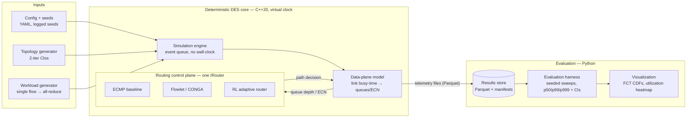

# GPU Fabric Congestion Simulator & Router

Deterministic discrete-event simulator for GPU training fabrics, with a
pluggable routing control plane and a seeded evaluation harness.
C++20 core · Python evaluation/visualization · CMake + CTest ·
reproducible-by-construction.

---

**Thesis.** In GPU training fabrics, tail flow-completion time (p99/p999 FCT)
under collective-communication traffic is dominated by transient congestion —
incast microbursts and ECMP hash collisions — that static routing cannot see.
This project builds a deterministic fabric simulator and asks one question:
how much tail-FCT does congestion-aware adaptive routing (a flowlet/CONGA-style
heuristic, and an RL policy trained on link telemetry) recover over static
ECMP, on Clos topologies up to 1024 nodes?

**Headline result.** *Pending — Phases 0–1 (reproducibility spine and walking
skeleton) are complete; the congestion model and validation gate (Phase 2)
come next. No routing comparison is claimed until the simulator reproduces a
known incast throughput-collapse curve.*

**Limitations.** Simulated fabric, packet-train (chunk) granularity — not
per-packet; virtual clock, single-threaded core; validated at 16–128 nodes,
headline scale 1024 nodes; single failure domain; no dynamic topology changes;
no PFC/lossless-fabric modeling yet. These bounds are deliberate and stated up
front: they are the boundary of the claim, not an apology for it.

---

## Table of contents

- [Quickstart](#quickstart)
- [What exists today](#what-exists-today)
- [Repository layout](#repository-layout)
- [Architecture overview](#architecture-overview)
- [Reproducibility invariants](#reproducibility-invariants)
- [Configuration reference](#configuration-reference)
- [Run artifacts](#run-artifacts)
- [Testing](#testing)
- [Documentation suite](#documentation-suite)
- [Phase status](#phase-status)
- [References](#references)

## Quickstart

Prerequisites: CMake ≥ 3.20, a C++20 compiler (GCC 13+ / Clang 16+),
Python ≥ 3.10, git.

```sh
# 1. Build the simulator core (Release)
cmake -B build -DCMAKE_BUILD_TYPE=Release
cmake --build build -j

# 2. Set up the Python evaluation environment (one-time)
python3 -m venv .venv
.venv/bin/pip install -r requirements.txt

# 3. One command = one figure
.venv/bin/python python/run.py configs/phase1_smoke.yaml
```

Step 3 produces a self-describing run directory:

```
results/20260717T212210Z_e303fbf4_3490e78e/
         └─ timestamp ──┘ └config──┘ └─git──┘
                           hash      SHA
```

containing the exact config, the manifest (config hash, git SHA, dirty flag),
every PRNG seed consumed, the raw telemetry (`flows.csv`), the canonical
Parquet artifact (`flows.parquet`), and the FCT CDF (`fct_cdf.png`).

Run the test suite (CI runs the same under ASan+UBSan):

```sh
cmake -B build-san -DCMAKE_BUILD_TYPE=Debug -DGPUFAB_SANITIZE=ON
cmake --build build-san -j
ctest --test-dir build-san --output-on-failure
```

## What exists today

- A single-threaded deterministic discrete-event engine
  (`src/gpufab/engine.{hpp,cpp}`) on an **integer-picosecond virtual clock**,
  scheduling events at **chunk** (packet-train) granularity — 64 KiB by
  default. No wall-clock, no sockets, no threads in the model path.
- A parameterized **two-tier Clos topology** generator
  (`src/gpufab/topology.{hpp,cpp}`): hosts → leaves → spines, full leaf–spine
  mesh, per-link bandwidth and propagation delay.
- The **`IRouter` interface** (`src/gpufab/router/irouter.hpp`) — the single
  seam the whole project pivots on — with static **ECMP** behind it as the
  control baseline.
- A **seeded PRNG registry** (`src/gpufab/rng.hpp`): one master seed, one
  derived stream per named component, every seed logged per run.
- The **file-based telemetry boundary** (`src/gpufab/telemetry.{hpp,cpp}` +
  `python/run.py`): engine emits CSV, Python converts to Parquet — the only
  thing that ever crosses between C++ and Python.
- An analytic correctness gate: the measured single-flow FCT equals the
  closed-form store-and-forward pipeline value **exactly**
  (`tests/test_engine_fct.cpp`), and two full end-to-end runs are
  byte-identical.

## Repository layout

```
├── CMakeLists.txt              # C++20, -Werror, GPUFAB_SANITIZE option
├── requirements.txt            # Python eval deps (pyarrow, pandas, matplotlib…)
├── configs/                    # git-tracked run configs (YAML) — one per figure
│   └── phase1_smoke.yaml
├── src/
│   ├── main.cpp                # gpufab_sim entry point: config → topo → engine → telemetry
│   └── gpufab/
│       ├── time.hpp            # Ps (int64 picoseconds), exact serialization delay
│       ├── rng.hpp             # RngRegistry: master seed → named, logged streams
│       ├── config.{hpp,cpp}    # flat dotted-key config parser (zero deps)
│       ├── topology.{hpp,cpp}  # 2-tier Clos builder, Link state
│       ├── flow.hpp            # Flow record
│       ├── engine.{hpp,cpp}    # discrete-event core, chunk event model
│       ├── telemetry.{hpp,cpp} # flows.csv / seeds.txt writers
│       └── router/
│           ├── irouter.hpp     # THE interface: ECMP / flowlet / RL swap here
│           └── ecmp.{hpp,cpp}  # static hashing control baseline
├── python/
│   ├── run.py                  # one YAML → one hash-stamped run directory
│   └── plot_fct.py             # FCT CDF from flows.parquet
├── tests/                      # CTest suite (plain-assert, zero test deps)
├── docs/
│   ├── architecture.html       # visual system diagram
│   ├── ARCHITECTURE.md         # enterprise architecture design (ADRs, components)
│   ├── DEPLOYMENT.md           # build/CI/operations document
│   └── PROJECT_PLAN.md         # phased plan, gates, risk register
├── .github/workflows/ci.yml    # sanitized tests + end-to-end artifact check
└── results/                    # run outputs (gitignored; configs are tracked instead)
```

## Architecture overview



The rose-colored loop in `docs/architecture.html` — data-plane congestion
signal → router path decision — is the intellectual core of the project. If
that loop is not real and closed, this is a topology visualizer, not a
congestion router. Full component-level design, interface contracts, and
architecture decision records: **[docs/ARCHITECTURE.md](docs/ARCHITECTURE.md)**.

## Reproducibility invariants

These are non-negotiable and enforced by tests and CI, not convention:

1. **Single-threaded discrete-event core.** Virtual clock only; no wall-clock,
   no OS sockets, no threads anywhere in the model path.
2. **Same seed + same config = byte-identical results, forever.** The clock is
   integer picoseconds, so serialization delays are exact for whole-Gbps rates
   and no floating-point drift can enter event ordering. Ties in the event
   queue break on insertion sequence, deterministically.
3. **Every figure regenerates from one command against a git-tracked config.**
   Configs live in `configs/`; run directories are stamped with the config
   hash and git SHA and record whether the working tree was dirty.
4. **Every random draw is attributable.** Components never construct their own
   RNGs; they request a named stream from `RngRegistry`, and each run logs the
   master seed plus every derived seed to `seeds.txt`.
5. **The router never sees wall-clock time.** The `IRouter` contract exposes
   topology and (from Phase 3) link telemetry only. Violating this breaks
   reproducibility and invalidates every comparison built on top.

## Configuration reference

Configs are YAML, flattened by `run.py` into a dotted-key file handed to the
binary (the C++ side stays dependency-free). Current schema:

| Key | Type | Meaning |
|---|---|---|
| `seed` | int | Master seed; all component streams derive from it |
| `topology.kind` | str | `clos2` (two-tier Clos) |
| `topology.hosts_per_leaf` | int | Hosts attached to each leaf switch |
| `topology.leaves` | int | Number of leaf (ToR) switches |
| `topology.spines` | int | Number of spine switches (ECMP width) |
| `topology.host_gbps` | int | Host–leaf link rate, Gbps (whole numbers keep the clock exact) |
| `topology.fabric_gbps` | int | Leaf–spine link rate, Gbps |
| `topology.prop_us` | int | Per-link propagation delay, µs |
| `router.name` | str | `ecmp` (Phase 3 adds `flowlet`; Phase 4 adds `rl`) |
| `workload.kind` | str | `single_flow` (Phase 2 adds `allreduce_ring`, `incast`, `permutation`) |
| `workload.src`, `workload.dst` | int | Host node ids for `single_flow` |
| `workload.bytes` | int | Flow size in bytes |
| `workload.chunk_bytes` | int | Packet-train granularity (default 65536) |

## Run artifacts

| File | Producer | Purpose |
|---|---|---|
| `config.yaml` | run.py | Exact copy of the input config |
| `sim.cfg` | run.py | Flattened config actually consumed by the binary |
| `manifest.json` | run.py | Config hash, git SHA, dirty flag, argv, timestamp |
| `seeds.txt` | C++ engine | Master seed + every derived per-component seed |
| `flows.csv` | C++ engine | Raw per-flow telemetry (id, src, dst, bytes, start/end/FCT in ps, path) |
| `flows.parquet` | run.py | **Canonical artifact** — the only thing Python analysis reads |
| `fct_cdf.png` | plot_fct.py | Flow-completion-time CDF |

## Testing

Plain-assert CTest executables, zero test-framework dependencies. CI runs the
suite under AddressSanitizer + UndefinedBehaviorSanitizer with
warnings-as-errors, then does a Release build and checks the full
YAML→Parquet→PNG pipeline end-to-end.

| Test | What it proves |
|---|---|
| `test_config` | Flat config parsing, comments, missing-key errors |
| `test_rng` | Stream determinism, component independence, seed logging |
| `test_topology` | Clos node/link counts, ECMP path validity hop-by-hop |
| `test_engine_fct` | Measured FCT **equals** the analytic pipeline value; run-to-run determinism |

## Documentation suite

| Document | Contents |
|---|---|
| [docs/ARCHITECTURE.md](docs/ARCHITECTURE.md) | System context, component catalog, event/time/data models, `IRouter` contract, ADRs, quality attributes, extension points |
| [docs/DEPLOYMENT.md](docs/DEPLOYMENT.md) | Environments, build matrix, CI/CD pipeline, experiment operations, results-store management, troubleshooting runbook |
| [docs/PROJECT_PLAN.md](docs/PROJECT_PLAN.md) | Goals/non-goals, phase plan with exit gates, milestone schedule, risk register, evaluation methodology |
| [docs/architecture.html](docs/architecture.html) | Visual architecture diagram (open in a browser) |

## Phase status

| Phase | Deliverable | Exit criterion | Status |
|---|---|---|---|
| 0 | Reproducibility spine | ctest green on stubs; one command → hash-stamped results dir | **Done** |
| 1 | Walking skeleton | An FCT CDF produced end-to-end through every layer | **Done** |
| 2 | Congestion emerges + validation | Plot next to a citation: incast throughput collapse reproduced | Next |
| 3 | Baselines + evaluation harness | ECMP vs flowlet CDF across many seeds, with error bands | — |
| 4 | RL adaptive router | Three-way CDF with CIs + honest analysis of where RL helps | — |
| 5 | Visualization + writeup | Link-utilization heatmap; README leads with thesis, result, limitations | — |

Scale policy: the headline number is **1024 simulated nodes**, validated at
16–128. This README will never drift toward "hundreds of thousands."

## References

- M. Al-Fares, A. Loukissas, A. Vahdat. *A Scalable, Commodity Data Center
  Network Architecture* (fat-tree/Clos bisection bandwidth). SIGCOMM 2008.
- V. Vasudevan et al. *Safe and Effective Fine-grained TCP Retransmissions for
  Datacenter Communication* (incast throughput collapse). SIGCOMM 2009.
- M. Alizadeh et al. *Data Center TCP (DCTCP)* (ECN-based congestion signal).
  SIGCOMM 2010.
- M. Alizadeh et al. *CONGA: Distributed Congestion-Aware Load Balancing for
  Datacenters* (flowlet switching). SIGCOMM 2014.
